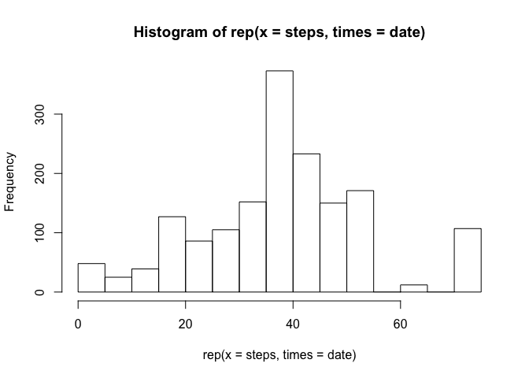
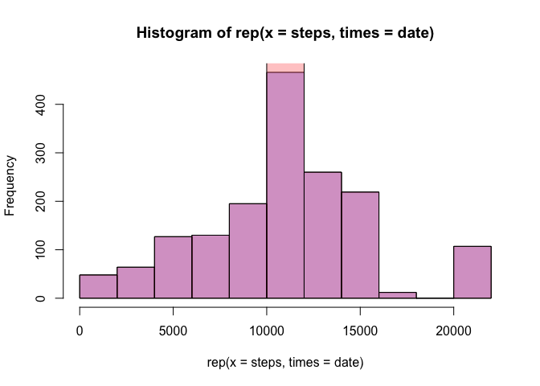
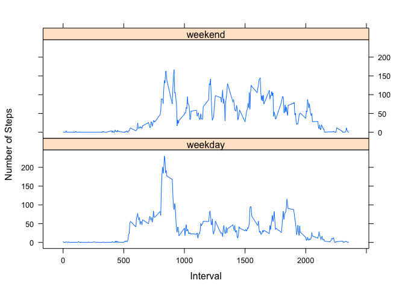

# Course Project 1
4/29/2017  


## Loading and preprocessing the data


```r
temp <- tempfile()
download.file("https://d396qusza40orc.cloudfront.net/repdata%2Fdata%2Factivity.zip",temp)
data <- read.csv(unz(temp, "activity.csv"))
unlink(temp)
```

## What is mean total number of steps taken per day?
#### Total Number, Mean and Median of steps taken per day

```r
steps_total <- aggregate(steps ~ date, data, sum)
steps_mean <- aggregate(steps ~ date, data, mean,na.action = na.omit)
steps_median <- aggregate(steps ~ date, data, median,na.action = na.omit)
```

#### Histogram of the total number of steps taken each day

```r
with(steps_mean, hist(rep(x = steps, times = date)))
```

<!-- -->

## What is the average daily activity pattern?


```r
steps_interval <- aggregate(steps ~ interval, data, mean,na.action = na.omit)
plot(steps ~ interval, steps_interval, type = "l")
```

<!-- -->

#### Which 5-minute interval, on average across all the days in the dataset, contains the maximum number of steps?

```r
tail(steps_interval[order(steps_interval$steps),],1)
```

```
##     interval    steps
## 104      835 206.1698
```


## Imputing missing values
#### Calculate and report the total number of missing values in the dataset 

```r
sum(is.na(data$steps))
```

```
## [1] 2304
```

#### Create a new dataset with NAs filled in based on mean over all intervals by day

```r
library(plyr)

data_na_filled <- data
impute.mean <- function(x) replace(x, is.na(x), mean(x, na.rm = TRUE))
data_na_filled <- ddply(data_na_filled, ~ interval, transform, steps = as.integer(impute.mean(steps)))
steps_total_na_filled <- aggregate(steps ~ date, data_na_filled, sum)
steps_mean_na_filled <- aggregate(steps ~ date, data_na_filled, mean,na.action = na.omit)
steps_median_na_filled <- aggregate(steps ~ date, data_na_filled, median,na.action = na.omit)
```

#### Differences in Histograms of the total number of steps taken each day with and without NAs filled

```r
with(steps_total, hist(rep(x = steps, times = date),col=rgb(0,0,1,1/4)))
with(steps_total_na_filled, hist(rep(x = steps, times = date),col=rgb(1,0,0,1/4), add=T))
```

<!-- -->

## Are there differences in activity patterns between weekdays and weekends?
#### Create a new factor variable in the dataset with two levels ??? ???weekday??? and ???weekend???

```r
data_na_filled$date <- as.Date(data_na_filled$date)
data_na_filled$weekday <- ifelse((weekdays(data_na_filled$date) == 'Saturday' | weekdays(data_na_filled$date) == 'Sunday') , 'weekend', 'weekday')
data_na_filled$weekday <- as.factor(data_na_filled$weekday)
```


#### Time Series Panel showing 5-minute interval and the average number of steps taken grouped by weekdays or weekend

```r
library(lattice)

steps_weekday <- aggregate(steps ~ weekday+interval, data_na_filled, mean,na.action = na.omit)

xyplot(steps~interval|weekday,
       type='l',data=steps_weekday,layout=c(1,2),
       xlab='Interval',ylab='Number of Steps')
```

<!-- -->
